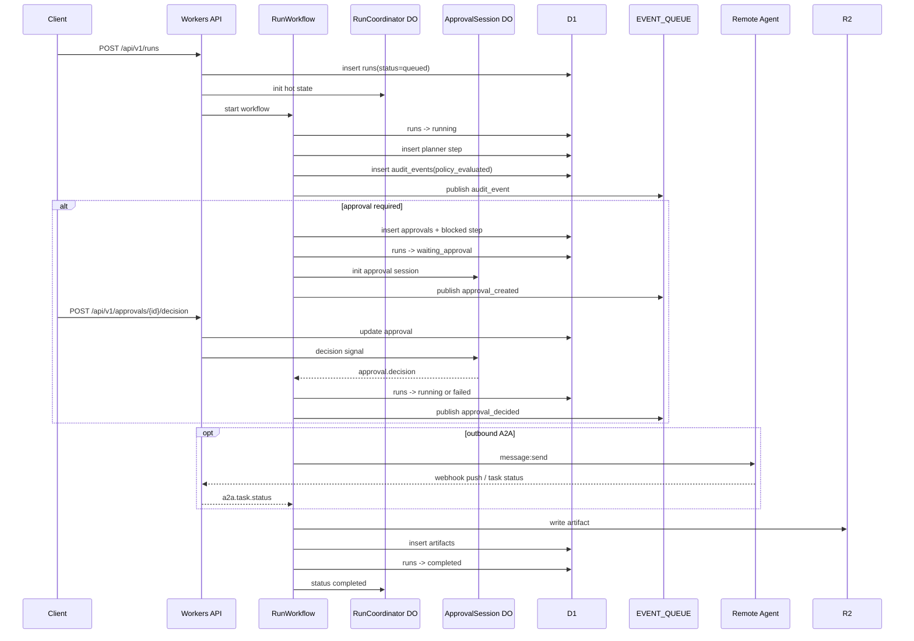

# Govrail 端到端流程與失敗語義手冊（MVP）

交付對象：Workflow / API / Admin UI / SRE 工程師  
版本：v0.1  
日期：2026-03-31

## 1. 文檔目的

本文件描述目前 MVP 代碼中的真實執行路徑、關鍵狀態轉移、失敗碼與可觀測證據來源。  
目標是讓開發、測試與排障人員可以回答三個問題：

- 這次請求目前卡在哪個階段？
- 這次失敗是業務拒絕、超時，還是外部系統失敗？
- 應該去 D1、R2、Queue 還是 Workflow 看哪一份證據？

## 2. 核心生命週期

### 2.1 正常主流程

MVP 目前的 `run` 大致遵循以下順序：

1. API 建立 `runs` 記錄，初始狀態為 `queued`
2. Workflow 啟動後將 run 轉為 `running`
3. 建立 planner step
4. 根據 input text 與 `policy_context.labels` 做 policy 判斷
5. 若命中高風險規則，建立 approval 並進入 `waiting_approval`
6. approval 通過後繼續執行 outbound A2A 派發
7. 若設定 `wait_for_completion = true`，等待遠端 A2A 任務回報
8. 寫入最終 artifact
9. run 轉為 `completed`

### 2.2 Mermaid 時序圖



## 3. 關鍵狀態轉移

### 3.1 Run 狀態

| 當前狀態 | 觸發條件 | 下一狀態 |
|---|---|---|
| `queued` | Workflow 啟動 | `running` |
| `running` | 命中 approval_required | `waiting_approval` |
| `waiting_approval` | approval 通過 | `running` |
| `waiting_approval` | approval 拒絕 | `failed` |
| `waiting_approval` | approval timeout | `failed` |
| `running` | 遠端 A2A 失敗/取消 | `failed` |
| `queued` / `running` / `waiting_approval` | API 取消 | `cancelled` |
| `running` | 主流程完成 | `completed` |

### 3.2 Approval 狀態

| 當前狀態 | 觸發條件 | 下一狀態 |
|---|---|---|
| `pending` | approver 決策 `approved` | `approved` |
| `pending` | approver 決策 `rejected` | `rejected` |
| `pending` | workflow wait timeout | `expired` |
| `pending` | run 被取消 | `cancelled` |

## 4. 各階段的證據來源

### 4.1 run 已建立但沒往前走

優先查看：

- `runs.status`
- Workflow instance 狀態
- `run_steps` 是否已出現 planner step

若只看到 `queued` 且沒有 step，通常代表 workflow 尚未啟動或啟動失敗。

### 4.2 run 卡在 `waiting_approval`

優先查看：

- `runs.pending_approval_id`
- `approvals.status`
- `audit_events` 中是否已有 `approval_created`

若 approval 仍為 `pending`，表示系統正在等決策。  
若 approval 已是 `expired` 或 `cancelled`，但 UI 仍顯示待處理，通常是前端狀態沒同步。

### 4.3 run 執行到 A2A

優先查看：

- `a2a_tasks`
- `run_steps.step_type = 'a2a_dispatch'`
- `audit_events.event_type = 'side_effect_executed'`

若 `wait_for_completion = true`，還要看是否已收到 `a2a.task.status` signal。

### 4.4 run 已完成

應至少能看到：

- `runs.status = completed`
- 一筆 `artifacts` 記錄
- R2 對應 artifact blob

## 5. 失敗語義與 error_code

### 5.1 目前已落地的 run error_code

| error_code | 觸發條件 | 說明 |
|---|---|---|
| `approval_rejected` | approver 明確拒絕 | 業務拒絕，不建議自動重試 |
| `approval_expired` | workflow 等待審批超時 | 人工審批逾時，需重新發起或 replay |
| `a2a_remote_failed` | 遠端 A2A 任務回報 `failed` 或 `cancelled` | 外部任務未成功完成 |

### 5.2 不是 run error_code，但常見的 API error code

| code | 場景 |
|---|---|
| `idempotency_conflict` | 同一 `Idempotency-Key` 對應不同 payload |
| `invalid_state_transition` | 對已終態 run / task 再取消，或對已過期 approval 再決策 |
| `tenant_access_denied` | 租戶或 approver 權限不匹配 |
| `tool_provider_not_found` | MCP provider 未配置 |

## 6. Approval 分支細節

### 6.1 Approval 建立

命中 approval 條件後，系統會同時完成以下動作：

- `approvals` 插入一筆 `pending`
- `run_steps` 插入一筆 `approval_wait`
- `runs.status` 轉為 `waiting_approval`
- 建立 `approval_created` audit event
- 發送 queue envelope 到 `EVENT_QUEUE`
- 初始化 `ApprovalSession` DO

### 6.2 Approval 通過

當 approver 送出 `approved`：

- approval 記錄更新為 `approved`
- `ApprovalSession` 發送 `approval.decision` signal 給 workflow
- workflow 清掉 `pending_approval_id`
- run 回到 `running`
- 寫入 `approval_decided` audit event

### 6.3 Approval 拒絕

當 approver 送出 `rejected`：

- approval 記錄更新為 `rejected`
- run 轉為 `failed`
- `error_code = approval_rejected`
- `completed_at` 立即填入

### 6.4 Approval 超時

若 workflow 在 24 小時內沒有等到決策：

- `approvals.status` 轉為 `expired`
- run 轉為 `failed`
- `error_code = approval_expired`
- 建立 `approval_expired` audit event
- queue 發送同名 audit envelope
- `ApprovalSession` 與 `RunCoordinator` 會同步被更新

### 6.5 Approval 因取消而終止

若 run 在 `waiting_approval` 期間被取消：

- `approvals.status` 轉為 `cancelled`
- run 轉為 `cancelled`
- 建立 `approval_cancelled` audit event
- workflow instance 會被 terminate

## 7. Queue 與審計事件

### 7.1 審計事件雙寫模型

MVP 目前採用：

1. 先寫 D1 `audit_events`
2. 再 fanout 到 `EVENT_QUEUE`

因此排障時應以 D1 為審計真相來源；Queue 主要用於後續 side effect 或非同步處理。

### 7.2 Queue envelope 關鍵欄位

每個 audit queue message 至少包含：

- `message_type = audit_event`
- `event_id`
- `event_type`
- `tenant_id`
- `run_id`
- `trace_id`
- `dedupe_key`

目前 audit fanout 的 dedupe 慣例為：

```text
audit_event:{event_id}
```

### 7.3 Queue consumer 行為

consumer 在收到 message 後：

1. 先檢查 schema 是否有效
2. 再將 `(queue_name, dedupe_key)` 嘗試寫入 `queue_dedupe_records`
3. 若已存在，記錄 duplicate log 並 `ack`
4. 若處理成功，記錄 processed log 並 `ack`
5. 若處理失敗，記錄 error log 並 `retry`

## 8. Replay 與取消語義

### 8.1 Replay

`POST /api/v1/runs/{run_id}/replay` 目前採用「重新建立一個新 run」的模式，而不是把舊 run 改回可執行狀態。

這代表：

- 原始 run 保持不可變
- replay run 會有自己的 `run_id`
- source run 只作為 trace 與審計來源

### 8.2 Cancel

目前可取消的 run 狀態只有：

- `queued`
- `running`
- `waiting_approval`

一旦 run 已經是：

- `completed`
- `failed`
- `cancelled`

再次取消會回 `409 invalid_state_transition`。

## 9. 最小排障路徑

當現場只給你一個 `run_id`，建議按以下順序排查：

1. 查 `runs` 看 `status`、`error_code`、`pending_approval_id`
2. 查 `run_steps` 看最後一個 step 類型
3. 查 `approvals` 看是否卡在 `pending`
4. 查 `audit_events` 看最後一個 domain event
5. 查 `a2a_tasks` 看遠端任務是否失敗或取消
6. 查 `queue_dedupe_records` 看 queue 是否已處理
7. 查 R2 artifact 是否已產出

## 10. 建議後續補強

目前這份手冊已覆蓋 MVP 代碼中實際存在的行為，但若要支撐更複雜場景，下一步建議補：

- MCP `tools/call` approval 分支的完整時序圖
- Workflow / DO / Queue 的關聯追蹤面板設計
- replay run 與 source run 的 UI 對照規則
- terminal 狀態下的告警與通知策略
